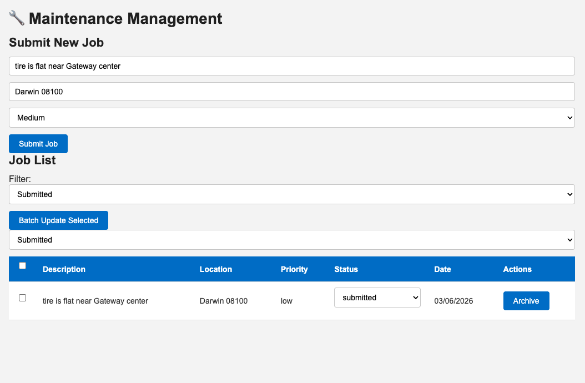

# 🔧 Maintenance Management App

A website to manage maintenance jobs. You can add jobs, update them, and track their status.

---

## What Can This App Do?

- Add a new job
- See all jobs in a list
- Change job information
- Change status of many jobs at the same time
- Hide a job (it is not deleted, just hidden)
- Show only jobs with a specific status

---

## What You Need First

Before you start, install these:

- [Node.js](https://nodejs.org/) — runs the server
- [MongoDB](https://www.mongodb.com/) — saves the data
- npm — comes with Node.js automatically

---
